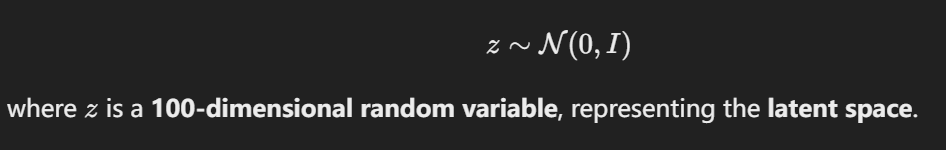
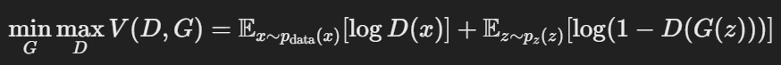
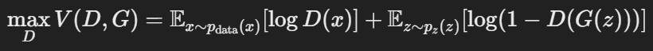
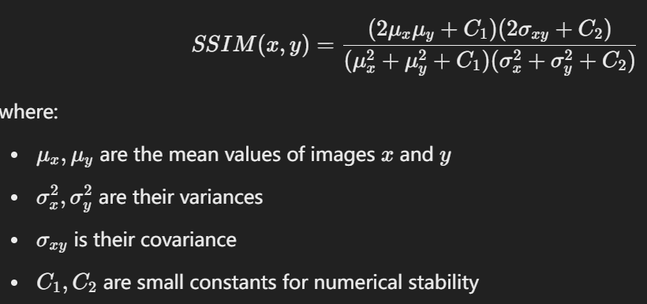
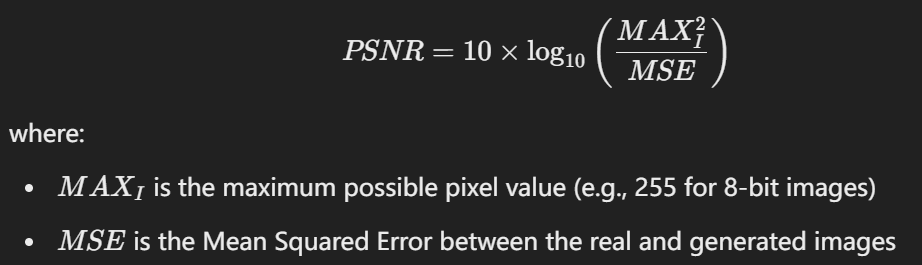
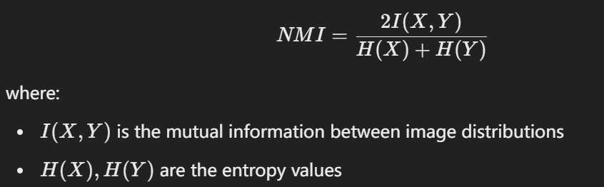
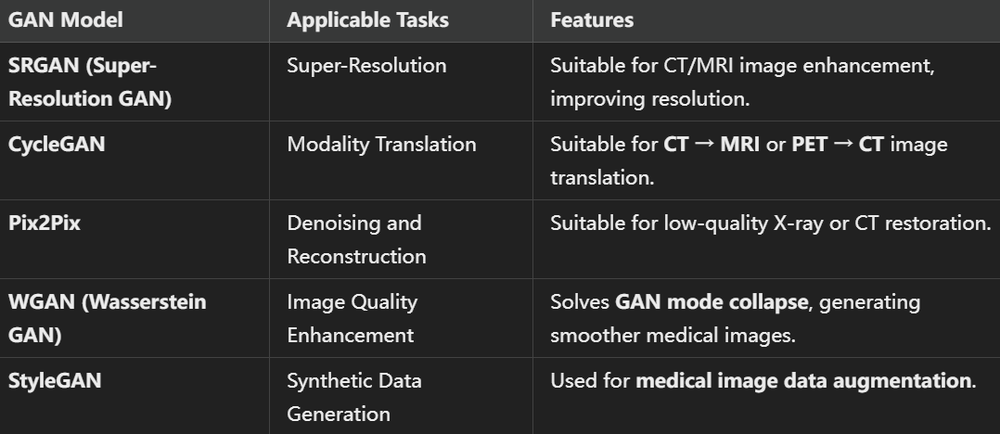

# CS498-MileStoneProject
Lehigh University CS 498 Milestone Term Long LLM Practice Project, work with Mr. Wang Jiaming, MS, jiwb22@lehigh.edu
Image Enhancement and Reconstruction in Medical Imaging Using Generative AI (GAI) and GANs

Welcome to the CS498 Milestone Project repository! This project explores the use of Generative Adversarial Networks (GANs) and other Generative AI (GAI) methods to enhance and reconstruct medical images (e.g., CT, MRI, and X-ray). Our goal is to understand how these advanced models can tackle challenges in medical data, such as data scarcity, image noise, low resolution, and privacy concerns.

# 1. Project Overview

## This repository is dedicated to investigating, designing, and demonstrating how Generative Adversarial Networks and related GAI models can be used in medical imaging:

   - Image Enhancement & Super-Resolution: Improving quality, clarity, and resolution of low-quality medical scans.
   - Image Reconstruction: Using GANs to reconstruct missing or corrupted image regions, potentially aiding in better diagnostics.
   - Data Augmentation: Generating synthetic medical images to expand training data and address limited real-world datasets.
   - Multimodal Image Translation: Converting between different imaging modalities (e.g., CT ↔ MRI) when one is missing or insufficient.
    

## The research will also examine privacy-preserving approaches—such as federated learning or synthetic data generation—that can respect patient confidentiality.
Motivation and Objectives   

   - Data augmentation: GAN generates realistic images to alleviate the lack of annotated data.
   - Image enhancement & super-resolution: reduce noise and improve resolution (e.g. low-dose CT → high-definition CT).
   - Multimodal conversion: such as CycleGAN converting CT ↔ MRI.
   - Segmentation and annotation assistance: generate annotated data or pseudo-color enhanced images.
   - Anomaly detection: compare the difference between "healthy" images and real images to find abnormal areas.
   - Privacy protection: synthesize anonymous images to replace real patient data.

## Key Features

   - Generative Adversarial Networks (GANs):
        Vanilla GANs for synthetic image generation.
        CycleGAN for image-to-image translation across different modalities.
        SRGAN for super-resolution enhancement (low- to high-resolution).
        WGAN / WGAN-GP to improve training stability and handle mode collapse.

   - Transformers and LLMs (planned future integration):
        Potential use of Transformer-based architectures for advanced feature extraction, language modeling (in medical text analysis), or combined image–text tasks.

   - Federated Learning (FL):
        Exploring how collaborative approaches can train GANs across multiple hospitals without sharing raw data.

## Research Goals

   - Create GANs models to enhance and reconstruct the medical images. 
   - Makes some tests and evaluations. 

## Research Questions
   - How does GAN perform in medical image enhancement and reconstruction?

   - What is the computational efficiency of GAN in medical image processing?

   - Is GAN-generated medical imaging reliable for clinical applications?

   - How does dataset diversity impact the generalization ability of GAN?

---
---

# 2. Theoretical Process Overview

## A. Data Preparation and Preprocessing

1. **Collecting Medical Imaging Data**  
   - Data sources: Public datasets or collaborating hospitals (e.g., MRI, CT, X-ray, etc.).

2. **Preprocessing**  
   - Normalization (e.g., [0,1] or [-1,1]).  
   - Denoising (such as removing high-frequency noise).  
   - Data augmentation (e.g., rotation, cropping, flipping) – Enhancing real data before using GANs to improve model generalization.

---

## B. GAN Model Construction and Training

### 1. Random Noise → Generator

   - The generator typically takes a **random noise vector z** (from a normal distribution) as input and outputs medical images (e.g., 256×256 grayscale images).
   - A **Tanh** activation function is applied to ensure image pixel values remain within the range [-1,1].\
   - The goal is for the generator G to generate images that can fool the discriminator D, making D(G(z))≈1.0.\
   

### 2. Discriminator  
   - Input: Either **real images** (from medical datasets) or **fake images** generated by the generator.  
   - Output: A probability value (**close to 1 → real, close to 0 → fake**).\
   - The discriminator D needs to correctly distinguish between real images x and generated images G(z).\

### 3. Adversarial Training  
   **Objective:**  
   - The generator improves by "fooling" the discriminator into classifying fake images as real.  
   - The discriminator learns to better differentiate between real and fake images.

   **Training Steps:**  
   1. The generator produces a new fake image from a random noise vector.  
   2. The discriminator classifies both real and fake images and computes loss.  
   3. Gradients from the loss are **backpropagated**—helping the generator generate more realistic images while enhancing the discriminator's ability to distinguish real from fake.

---

## C. Model Evaluation and Comparison

### **Evaluation Metrics (Quantitative Measures)** 
1. **SSIM (Structural Similarity Index)** – Closer to 1 is better; measures structural similarity between real and generated images.\
 
 
2. **PSNR (Peak Signal-to-Noise Ratio)** – Typically, values above 30 dB indicate high-quality reconstructed images.\
&nbsp;&nbsp;&nbsp;&nbsp;&nbsp;&nbsp;&nbsp;&nbsp;MSE (Mean Squared Error) – Measures pixel-level reconstruction error.\
 
 
3. **Intersection over Union (IoU)** – Measures the overlap between ground truth and GAN-generated segmentation results. Higher is better.\
   
  
4. **Area Under the Curve (AUC)** – Evaluates GAN-generated medical images in classification tasks. Above 0.9 indicate strong classification performance.
  
5. **Normalized Mutual Information (NMI)** -Evaluates the diversity of GAN-generated images to prevent mode collapse. Higher NMI means GANs are generating diverse, high-quality images.

\  

### **Experimental Comparison**

- Testing multiple GAN variants (e.g., **DCGAN, CycleGAN, Pix2Pix, WGAN**) on the same dataset for comparison.  
- Observing differences in **image quality, training stability, convergence speed, and computational efficiency**.

---
---

## 3. Resources and References

   - Project Docs
        Milestone1 PDF (Describes the official requirements and grading details.)
        GANs in Medical Imaging Paper (Key literature on modern GAN advances and challenges.)

   - Relevant Research Papers
        S. Islam et al.: Generative Adversarial Networks (GANs) in Medical Imaging: Advancements, Applications, and Challenges. IEEE Access, 2024.
        S. Sai et al.: Generative AI for Transformative Healthcare: A Comprehensive Study of Emerging Models, Applications, Case Studies, and Limitations. IEEE Access, 2024.

   - Datasets (Pending)